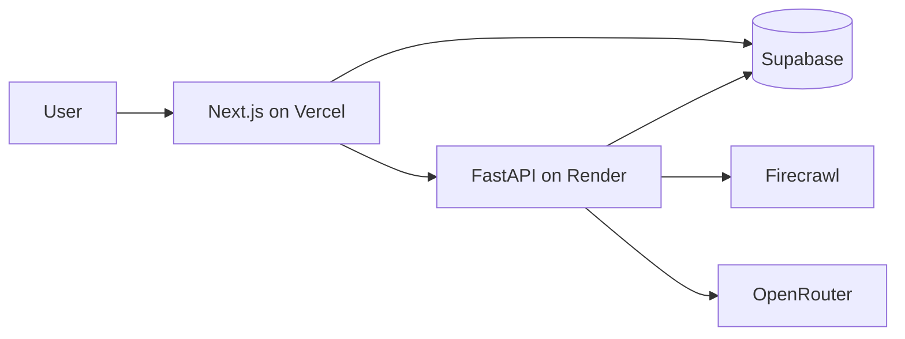

# Assignment Deployment Retrospective

This document records the deployment issues found during development and the
changes required for a stable, live assignment demo. The intended deployment is
the real pipeline: Vercel for the Next.js UI, Render for the FastAPI service,
Supabase for data, Firecrawl for search/crawling, and OpenRouter for structured
LLM extraction.

## Target deployment



The submitted live link should be the Vercel dashboard URL. The Render service
is an API dependency, not the user-facing demo.

## Problems found and how they were addressed

### 1. Browser requests failed even while the API was healthy

**Problem:** Local Next.js can move from port 3000 to 3001. The browser then
sent a CORS preflight request from `localhost:3001`, but the API allowed only
the configured frontend URL, producing a browser-side `Failed to fetch`.

**Fix:** The API now allows localhost development origins and takes
`FRONTEND_URL` for the deployed Vercel origin. Before deploying, set
`FRONTEND_URL` to the exact production Vercel URL. Do not use a wildcard CORS
policy in the final deployment.

**Verification:** Open the Vercel link, check `/health` through the UI, and run
a discovery request from the deployed Discover page.

### 2. Development reload interrupted long-running work

**Problem:** `uvicorn --reload` restarts the API process after source changes.
Discovery is currently an in-process FastAPI background task, so a restart
abandons an active run and leaves the UI waiting for a terminal status.

**Fix:** The Dockerfile and `render.yaml` disable reload with
`UVICORN_RELOAD=0`. A stale-run reaper marks stranded runs as failed rather
than leaving them indefinitely in progress.

**Deployment limitation:** This is appropriate for an assignment demo, but a
production system should move discovery to a durable job queue (for example,
pgmq, Celery, or a managed worker).

### 3. LLM work was too expensive and slow

**Problem:** Earlier processing could make several LLM calls per company:
profile extraction, signals across individual pages, contacts, and summary.
Resolving many search hits with an LLM compounded the delay and risked rate
limits.

**Fix:** The current path:

- caps generated search templates according to the requested company count;
- ranks search pages and applies LLM resolution only to the first six;
- resolves the remaining page budget with heuristics;
- deduplicates candidates before enrichment;
- scrapes up to three company pages concurrently;
- uses one structured `enrich_company_bundle` call per retained company for
  profile, signals, contacts, and summary;
- computes the final score with deterministic Python rules;
- limits company processing to two concurrent jobs and LLM traffic to
  15 requests per minute.

**Deployment check:** Keep `LLM_MODEL=openai/gpt-4o-mini`,
`MAX_COMPANY_CONCURRENCY=2`, and `LLM_REQUESTS_PER_MINUTE=15` for the
assignment demo. Increasing concurrency without raising the upstream quota
will queue calls rather than reliably shorten runs.

### 4. Successful enrichments were reported as failed

**Problem:** Query industries from the Discover form were being treated as a
hard ICP filter. A correctly enriched company categorized as, for example,
Fintech rather than SaaS could be discarded after the LLM succeeded, causing
the run to show false company failures.

**Fix:** Search industries are now search/ranking context and an ICP scoring
bonus; optional stage, headcount, and country remain filters. The graph
distinguishes an ICP skip from a persistence failure.

### 5. Schema drift caused writes and live dashboard queries to fail

**Problem:** The API relies on `discovery_run_id`, `source`,
`last_checked_at`, `completed_with_errors`, and contacts. These were added
across later Supabase migrations, so an un-migrated hosted database can reject
otherwise valid writes.

**Fix:** Apply all migrations before deployment:

```bash
supabase db push --include-all
```

Confirm the hosted schema has migrations `001_initial_schema.sql`,
`002_contacts.sql`, and `003_review_fixes.sql`. The API has a narrow fallback
when optional company columns are absent, but that fallback is only protection
while diagnosing drift; it is not the deployed schema.

### 6. Free hosting can sleep during the demo

**Problem:** A Render free service may cold-start. The first discovery request
can therefore appear slow or hit a frontend timeout even though the pipeline
is correct.

**Fix:** Use an always-on Render instance if available. Otherwise open the
health endpoint shortly before the demonstration and run a small discovery
(five companies) during the recording. The UI waits for long discovery runs,
but a cold start still makes the first interaction slower.

## Required production environment variables

### Vercel (`apps/web`)

- `NEXT_PUBLIC_SUPABASE_URL`
- `NEXT_PUBLIC_SUPABASE_ANON_KEY`
- `NEXT_PUBLIC_AI_SERVICE_URL=https://<render-service>.onrender.com`

### Render (`apps/ai-service`)

- `FRONTEND_URL=https://<vercel-project>.vercel.app`
- `SUPABASE_URL`
- `SUPABASE_SERVICE_ROLE_KEY`
- `OPENROUTER_API_KEY`
- `FIRECRAWL_API_KEY`
- `LLM_MODEL=openai/gpt-4o-mini`
- `UVICORN_RELOAD=0`
- `MAX_COMPANY_CONCURRENCY=2`
- `LLM_REQUESTS_PER_MINUTE=15`
- `SEARCH_PROVIDER=firecrawl`

Never expose the service-role, Firecrawl, or OpenRouter key through
`NEXT_PUBLIC_*` variables, source control, screenshots, or the submitted
repository.

## Deployment sequence

1. Push the repository and confirm CI passes: API tests, review committee,
   web lint, web tests, and web build.
2. Apply hosted Supabase migrations and verify the dashboard can read
   `companies`, `signals`, and `discovery_runs`.
3. Create the Render web service from `render.yaml`; add the API environment
   variables; wait for `/health` to return 200.
4. Deploy `apps/web` to Vercel; add its public environment variables; redeploy
   after setting the Render API URL.
5. Set Render `FRONTEND_URL` to the final Vercel origin and redeploy Render.
6. From the live Vercel Discover page, run a five-company discovery and verify
   companies, signals, scores, and the run status appear in Supabase.
7. Submit the Vercel URL. Optionally set the GitHub Actions
   `AI_SERVICE_URL` secret to activate scheduled discovery and stale-lead
   rechecks.

## Assignment-demo scope

This deployment is intentionally sized for a live assignment demonstration:
small batches, rate-limited LLM calls, an in-process background job, and
real third-party services. It is not presented as a high-volume production
worker architecture.
